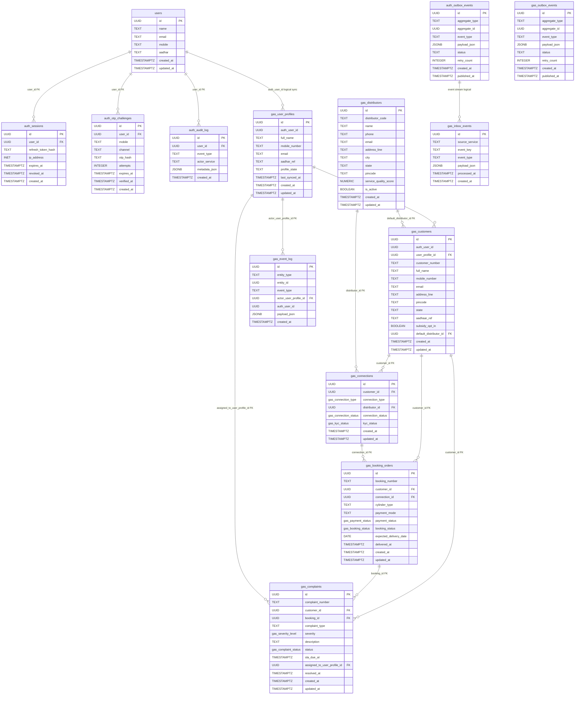

# Database Table Relationship Diagram

Date: 2026-04-15
Scope: Auth service and Gas Distribution service

## Overview

This diagram maps relational links and logical cross-service links between auth and gas tables in the current microservices design.

- Solid relationship labels indicate database-level foreign-key relationships.
- Labels containing "logical" indicate non-FK, event-driven or replicated links.

## Notes

- Gas tables are decoupled from direct auth-table foreign keys.
- Identity replication into gas is handled by event-driven synchronization.
- This supports service-level database ownership in a microservices architecture.
